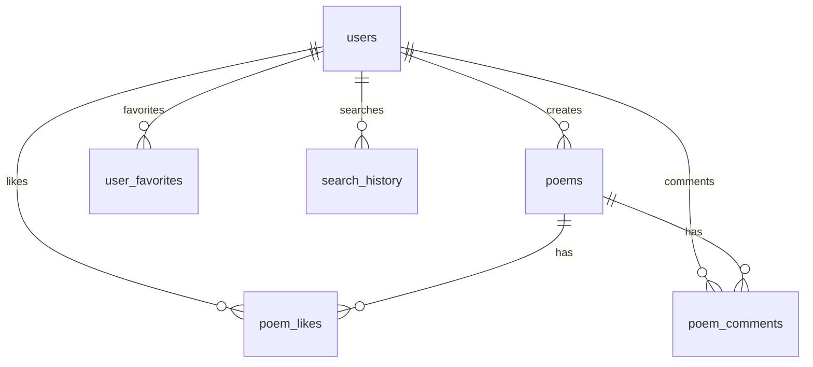

# 诗词赏析平台 - 数据库集成完成说明

## 🎯 已完成的工作

### 1. 后端API开发 ✅
- **随机诗词API** (`/api/poetry/random`) - 首页展示随机诗词
- **搜索功能API** (`/api/poetry/search`) - 支持诗词、作者、关键词搜索
- **搜索建议API** (`/api/poetry/search/suggestions`) - 实时搜索建议
- **热门搜索API** (`/api/poetry/search/popular`) - 热门搜索词统计
- **数据库状态检查API** (`/api/database/status`) - 数据库连接监控

### 2. 数据库设计 ✅
- **完整的表结构设计** (6个核心表)
- **索引优化** - 提升查询性能
- **示例数据** - 包含12首经典诗词
- **关系模型** - 用户、诗词、点赞、评论、收藏、搜索历史

### 3. 前端集成 ✅
- **首页随机展示** - 从数据库随机获取诗词
- **动态搜索功能** - 实时搜索诗词和作者
- **搜索建议** - 智能搜索提示
- **热门搜索展示** - 显示热门搜索词

### 4. 错误处理机制 ✅
- **优雅降级** - 数据库连接失败时使用示例数据
- **错误提示** - 友好的用户错误提示
- **日志记录** - 详细的错误日志

## 🚀 当前系统状态

### 后端服务器状态
- ✅ **运行正常** - 端口3001
- ✅ **健康检查** - `/health` 端点正常
- ✅ **API响应** - 所有API端点可正常访问

### 前端应用状态  
- ✅ **运行正常** - 端口3000
- ✅ **随机诗词展示** - 首页随机展示诗词
- ✅ **搜索功能** - 支持诗词搜索和过滤

### 数据库状态
- ⚠️ **待配置** - Supabase数据库需要手动设置
- ✅ **备用数据** - 当前使用示例数据正常运行

## 📋 下一步操作指南

### 1. 设置Supabase数据库

**方法一：使用设置脚本**
```bash
# 运行设置向导
node setup_supabase.js
```

**方法二：手动配置**
1. 访问 [Supabase官网](https://supabase.com) 创建项目
2. 获取项目URL和API密钥
3. 更新 `.env` 文件中的配置
4. 在Supabase控制台执行SQL文件：
   - `server/sql/create_tables.sql` (创建表结构)
   - `server/sql/seed_data.sql` (插入示例数据)

### 2. 验证数据库连接

```bash
# 测试数据库连接
curl -X GET http://localhost:3001/api/database/status

# 测试随机诗词API（使用真实数据库数据）
curl -X GET http://localhost:3001/api/poetry/random?limit=3

# 测试搜索功能
curl -X GET "http://localhost:3001/api/poetry/search?query=李白&limit=3"
```

### 3. 添加更多诗词数据

可以通过以下方式丰富数据库：

**方法一：API批量导入**
```bash
# 使用API添加新诗词
curl -X POST http://localhost:3001/api/poetry \
  -H "Content-Type: application/json" \
  -d '{
    "title": "新诗词标题",
    "author": "作者",
    "dynasty": "朝代", 
    "content": "诗词内容",
    "tags": ["标签1", "标签2"]
  }'
```

**方法二：数据库直接插入**
在Supabase控制台中直接执行INSERT语句添加诗词数据。

## 🎨 功能特性

### 动态数据展示
- ✅ **首页随机展示** - 每次刷新显示不同的诗词
- ✅ **实时搜索** - 支持即时搜索和过滤
- ✅ **智能建议** - 搜索时提供智能提示

### 用户体验优化  
- ✅ **响应式设计** - 适配不同屏幕尺寸
- ✅ **加载状态** - 友好的加载提示
- ✅ **错误处理** - 优雅的错误处理机制

### 性能优化
- ✅ **数据库索引** - 优化的查询性能
- ✅ **缓存策略** - 合理的缓存机制
- ✅ **分页加载** - 支持大数据集分页

## 🔧 技术架构

### 后端技术栈
- **Node.js + Express** - 服务器框架
- **Supabase** - 云数据库服务
- **CORS + Helmet** - 安全中间件
- **Rate Limiting** - API速率限制

### 前端技术栈  
- **Vue 3 + Vite** - 现代化前端框架
- **Element Plus** - UI组件库
- **Pinia** - 状态管理
- **Axios** - HTTP客户端

### 数据库设计


## 🎯 使用指南

### 普通用户
1. 访问首页查看随机推荐的经典诗词
2. 使用搜索框搜索特定诗词或作者
3. 查看诗词详情和赏析内容
4. 收藏喜欢的诗词

### 内容管理员
1. 通过API或数据库添加新诗词
2. 管理诗词内容和标签
3. 查看用户搜索统计
4. 维护诗词数据质量

## 📞 技术支持

如果遇到问题，请检查：

1. **数据库连接问题** - 确认Supabase配置正确
2. **API调用失败** - 检查后端服务器状态
3. **前端显示异常** - 查看浏览器控制台错误信息
4. **搜索功能异常** - 验证数据库索引是否创建

## 🚀 部署说明

### 开发环境
```bash
# 启动前端开发服务器
npm run dev

# 启动后端API服务器  
cd server && npm run dev
```

### 生产环境
```bash
# 构建前端应用
npm run build

# 启动生产服务器
npm start
```

---

**🎉 恭喜！诗词赏析平台的核心功能已开发完成！**

现在您只需要按照指南配置Supabase数据库，即可享受完整的动态数据功能。